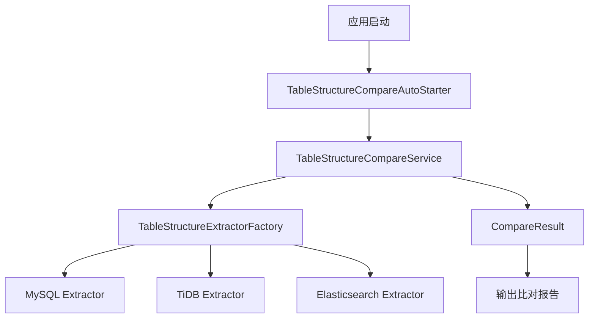

# HDS Schema Tools

异构数据源表结构比对工具，支持 MySQL、TiDB、Elasticsearch 等数据源之间的表结构比对。

## 项目结构

```
hds-schema-tools/
├── hds-schema-compare/  # 表结构比对模块
└── hds-schema-compare-example/  # 表结构比对使用示例
```

## 功能特点

- 支持多种数据源之间的表结构比对
- 支持表级属性比对
- 支持列结构比对
- 支持索引结构比对
- 支持自定义忽略字段和比对类型
- 支持批量表比对
- 支持详细的比对报告
- 支持ES与MySQL族数据库的特殊处理（如nullable、default值等）

## 架构图



## 配置说明

### 数据源配置

```yaml
spring:
  datasource:
    mysql:
      jdbcUrl: jdbc:mysql://localhost:3306/db_name
      username: user
      password: password
      driver-class-name: com.mysql.cj.jdbc.Driver
    tidb:
      jdbcUrl: jdbc:mysql://tidb-host:4000/db_name
      username: user
      password: password
      driver-class-name: com.mysql.cj.jdbc.Driver
    elasticsearch:
      hosts: http://localhost:9200
      username: user
      password: password
```

### 比对配置

```yaml
jtools:
  hdscompare:
    config:
      auto-compare-on-startup: true  # 是否在应用启动时自动执行比对
      verbose-output: true          # 是否输出详细的比对信息
    compare-configs:
        - name: "mysql-to-tidb-compare"  # 比对配置名称
          source-data-source:           # 源数据源配置
            type: "mysql"               # 数据源类型
            data-source-name: "mysqlDataSource"  # 数据源名称
          target-data-source:           # 目标数据源配置
            type: "tidb"                # 数据源类型
            data-source-name: "tidbDataSource"   # 数据源名称
          table-configs:                # 表比对配置列表
            - source-table-name: "table1"  # 源表名
              target-table-name: "table1"  # 目标表名
              ignore-fields:              # 忽略的字段列表
                - "create_time"
                - "update_time"
              ignore-types:              # 忽略的比对类型
                - "COMMENT"
                - "INDEX"
            - source-table-name: "table2"  # 另一个表的比对配置
              target-table-name: "table2"
        ignore-fields:
          - "create_time"
        ignore-types:
          - "COMMENT"
```

### 配置说明

1. 数据源配置
   - 支持配置多个数据源
   - 每个数据源需要配置 jdbcUrl、username、password 等基本信息
   - 数据源名称需要与比对配置中的 data-source-name 对应

2. 比对配置
   - name: 比对配置的名称，用于区分不同的比对任务
   - source-data-source: 源数据源配置
     - type: 数据源类型，如 mysql、tidb 等
     - data-source-name: 数据源名称，对应 spring.datasource 中配置的数据源
   - target-data-source: 目标数据源配置
     - type: 数据源类型
     - data-source-name: 数据源名称
   - table-configs: 表比对配置列表
     - source-table-name: 源表名
     - target-table-name: 目标表名
     - ignore-fields: 忽略的字段列表
     - ignore-types: 忽略的比对类型

3. 忽略类型说明
   - COMMENT: 忽略注释差异
   - INDEX: 忽略索引差异
   - NULLABLE: 忽略是否允许为空的差异
   - DEFAULT: 忽略默认值差异
   - LENGTH: 忽略长度差异
   - PRECISION: 忽略精度差异
   - SCALE: 忽略小数位数差异
   - AUTO_INCREMENT: 忽略自增属性差异

## 使用示例

1. 配置数据源和比对规则
2. 启动应用，自动执行比对
3. 查看比对结果

## 开发说明

### 项目结构

```
hds-schema-tools/
├── hds-schema-compare/
│   ├── src/
│   │   ├── main/
│   │   │   ├── java/
│   │   │   │   └── org/wesuper/jtools/hdscompare/
│   │   │   │       ├── config/          # 配置类
│   │   │   │       ├── extractor/       # 表结构提取器
│   │   │   │       ├── model/          # 数据模型
│   │   │   │       └── service/        # 服务实现
│   │   │   └── resources/
│   │   │       └── application.yml     # 配置文件
│   │   └── test/                       # 测试代码
│   └── pom.xml                         # 项目依赖
└── hds-schema-extract/
    ├── src/
    │   ├── main/
    │   │   ├── java/
    │   │   │   └── org/wesuper/jtools/hdsextract/
    │   │   │       ├── config/          # 配置类
    │   │   │       ├── extractor/       # 表结构提取器
    │   │   │       ├── model/          # 数据模型
    │   │   │       └── service/        # 服务实现
    │   │   └── resources/
    │   │       └── application.yml     # 配置文件
    │   └── test/                       # 测试代码
    └── pom.xml                         # 项目依赖
```

### 扩展支持

1. 添加新的数据源支持
   - 实现 TableStructureExtractor 接口
   - 在 TableStructureExtractorFactory 中注册新的提取器

2. 添加新的比对规则
   - 在 CompareResult 中添加新的差异类型
   - 在 TableStructureCompareServiceImpl 中实现新的比对逻辑

## 注意事项

1. 数据源配置
   - 确保数据源配置正确
   - 确保数据源名称与比对配置对应

2. 表结构比对
   - 建议先比对表结构，再进行数据迁移
   - 注意处理不同数据源之间的类型映射

3. 性能考虑
   - 大量表比对时注意内存使用
   - 考虑分批执行比对任务

## 贡献指南

1. Fork 项目
2. 创建特性分支
3. 提交代码
4. 创建 Pull Request

## 许可证

MIT License 