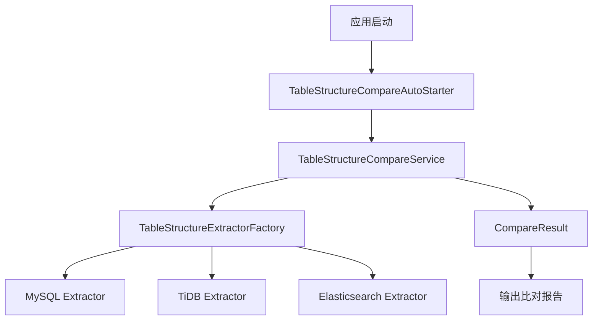

# HDS Schema Compare

异构数据源表结构比对工具，支持MySQL、TiDB、Elasticsearch和Java POJO之间的结构比对。

## 功能特性

- 支持MySQL、TiDB、Elasticsearch和Java POJO之间的表结构比对
- 支持表级属性比对（表注释、表属性等）
- 支持列级属性比对（列名、数据类型、是否可空、默认值、注释等）
- 支持索引结构比对（主键、唯一索引、普通索引等）
- 支持忽略特定字段或比对类型
- 支持POJO类与数据库表结构的比对，自动处理JsonProperty等注解

## 功能特点

- 支持多种数据源之间的表结构比对
- 支持表级属性比对
- 支持列结构比对
- 支持索引结构比对
- 支持自定义忽略字段和比对类型
- 支持批量表比对
- 支持详细的比对报告
- 支持ES与MySQL族数据库的特殊处理（如nullable、default值等）

## 架构图



## 配置说明

### 基本配置

```yaml
jtools:
  hdscompare:
    config:
      # 是否在应用启动时自动执行比对
      auto-compare-on-startup: true
      # 是否输出详细的比对信息
      verbose-output: true
      # 比对配置列表
      compare-configs:
        - name: "example-compare"
          # 源数据源配置
          source-data-source:
            type: "mysql"  # 支持：mysql、tidb、elasticsearch、pojo
            data-source-name: "sourceDataSource"  # 当type为pojo时可不填
          # 目标数据源配置
          target-data-source:
            type: "elasticsearch"
            data-source-name: "targetDataSource"
          # 表比对配置列表
          table-configs:
            - source-table-name: "source_table"  # 当source-data-source.type为pojo时，填写Java类的全限定名
              target-table-name: "target_table"
              # 忽略的字段列表
              ignore-fields:
                - "field1"
                - "field2"
              # 忽略的比对类型
              ignore-types:
                - "COMMENT"
                - "DEFAULT"
```

### POJO比对配置示例

```yaml
jtools:
  hdscompare:
    config:
      compare-configs:
        - name: "pojo-to-mysql"
          source-data-source:
            type: "pojo"
            # data-source-name 可不填
          target-data-source:
            type: "mysql"
            data-source-name: "mysqlDataSource"
          table-configs:
            - source-table-name: "com.example.model.User"  # Java类的全限定名
              target-table-name: "user_table"
```

## 类型映射说明

### POJO类型映射

POJO类型会自动映射到对应的数据库类型：

- 数值类型：
  - long/Long -> bigint
  - int/Integer -> int
  - short/Short -> smallint
  - byte/Byte -> tinyint
  - float/Float -> float
  - double/Double -> double
  - BigDecimal -> decimal

- 字符串类型：
  - String -> varchar
  - char/Character -> char

- 日期时间类型：
  - Date -> date
  - LocalDate -> date
  - LocalDateTime -> datetime
  - LocalTime -> time
  - Timestamp -> timestamp

- 布尔类型：
  - boolean/Boolean -> boolean

### MySQL到ES类型映射

- 数值类型：
  - bigint -> long
  - int -> integer
  - tinyint -> byte
  - smallint -> short
  - float -> float
  - double -> double
  - decimal -> scaled_float

- 字符串类型：
  - varchar -> keyword/text
  - char -> keyword
  - text -> text
  - longtext -> text
  - mediumtext -> text
  - tinytext -> text

- 日期时间类型：
  - datetime -> date
  - timestamp -> date
  - date -> date
  - time -> date

- 布尔类型：
  - boolean -> boolean
  - bool -> boolean

- 枚举类型：
  - enum -> keyword

## 使用说明

1. 添加依赖：

```xml
<dependency>
    <groupId>org.wesuper.jtools</groupId>
    <artifactId>hds-schema-compare</artifactId>
    <version>${latest.version}</version>
</dependency>
```

2. 配置数据源和比对规则

3. 注入服务并调用：

```java
@Autowired
private TableStructureCompareService compareService;

// 比对所有配置的表
List<CompareResult> results = compareService.compareAllConfiguredTables();

// 根据配置名称比对表
CompareResult result = compareService.compareTablesByName("example-compare");
```

## 注意事项

1. POJO比对时，会优先使用JsonProperty注解的值作为字段名
2. POJO比对时，会忽略Java中的nullable和default value等要求
3. 对于ES特有的字段（如number_of_replicas、number_of_shards等），在比对时会被忽略
4. 建议在比对ES时，忽略不影响数据检索和展示的属性（如creation_date、uuid等）

## 开发说明

### 项目结构

```