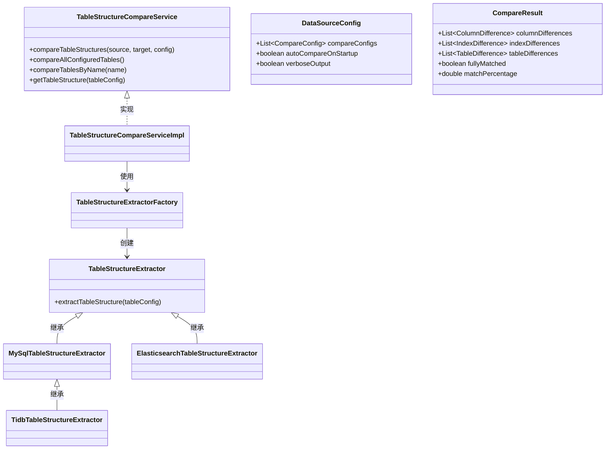
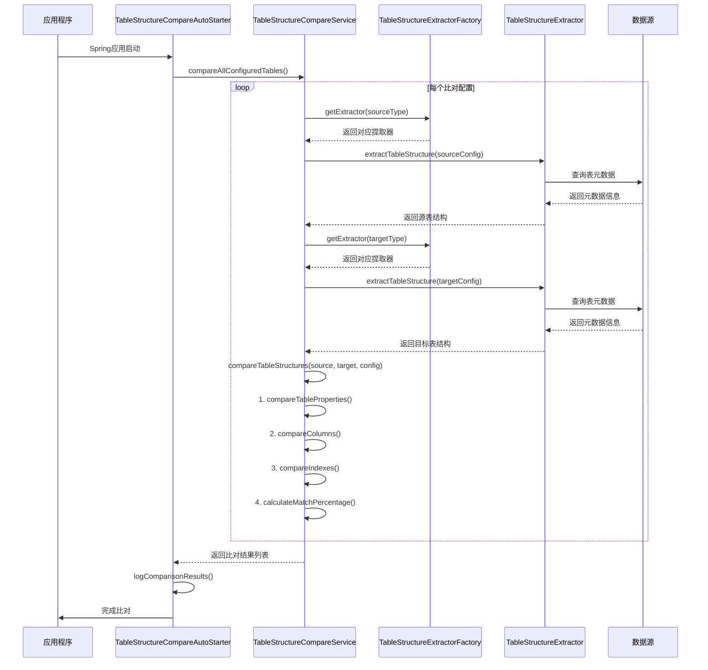

# 异构数据源表结构比对模块

[](LICENSE)

## 简介

该模块提供了一个强大的异构数据源表结构比对工具，可以对不同类型数据源中的表结构进行差异分析和比对，支持MySQL、TiDB和Elasticsearch等多种数据源类型。通过该工具，可以自动发现并报告表结构的差异，包括列定义、索引结构、表属性等多方面内容，帮助用户确保不同数据库环境中表结构的一致性。

## 主要功能

- **多数据源支持**: 支持MySQL、TiDB、Elasticsearch等不同类型数据源的表结构提取和比对
- **自动比对启动**: 可以在应用程序启动时自动执行配置好的表结构比对任务
- **灵活的配置**: 支持忽略特定字段、忽略特定类型的差异（如索引、注释等）
- **差异分级**: 将差异按严重程度分为CRITICAL（严重）、WARNING（警告）、NOTICE（通知）、ACCEPTABLE（可接受）四个级别
- **结构化差异报告**: 提供表格式的差异报告，清晰展示表结构的所有差异

## 使用场景

- **数据迁移验证**: 在数据从一个数据源迁移到另一个数据源后，验证表结构是否完整保留
- **多环境一致性检查**: 确保开发、测试、生产等不同环境中的表结构保持一致
- **数据库升级验证**: 在数据库版本升级后，验证表结构是否符合预期
- **异构数据源同步**: 在不同类型数据库之间同步表结构时，监控并报告差异

## 快速开始

### 配置

在application.yml中配置数据源和比对任务：

```yaml
hydra:
  heterogeneous-compare:
    auto-compare-on-startup: true
    verbose-output: true
    compare-configs:
      - name: "mysql-to-tidb-compare"
        source-table:
          type: "mysql"
          data-source-name: "mysqlDataSource"
          table-name: "user_info"
        target-table:
          type: "tidb"
          data-source-name: "tidbDataSource"
          table-name: "user_info"
        ignore-fields:
          - "create_time"
          - "update_time"
        ignore-types:
          - "COMMENT"
          - "INDEX"
```

### 编程方式调用

```java
@Autowired
private TableStructureCompareService compareService;

// 执行特定名称的比对任务
CompareResult result = compareService.compareTablesByName("mysql-to-tidb-compare");

// 执行所有配置的比对任务
List<CompareResult> results = compareService.compareAllConfiguredTables();

// 分析比对结果
if (result.isFullyMatched()) {
    System.out.println("表结构完全匹配");
} else {
    System.out.println("发现 " + result.getCriticalDifferenceCount() + " 个严重差异");
    System.out.println("发现 " + result.getWarningDifferenceCount() + " 个警告差异");
}
```

## 架构设计

### 核心组件



### 交互流程



## 扩展能力

该模块设计为高度可扩展的架构，以支持各种数据源类型和自定义比对逻辑。以下是主要的扩展点：

### 1. 添加新的数据源支持

要添加新的数据源类型支持，只需实现 `TableStructureExtractor` 接口：

```java
public class NewDatabaseTypeExtractor implements TableStructureExtractor {
    @Override
    public TableStructure extractTableStructure(DataSourceConfig.TableConfig tableConfig) throws Exception {
        // 实现从新数据库类型提取表结构的逻辑
    }
}
```

然后在 `TableStructureExtractorFactory` 中注册新的提取器：

```java
@Component
public class TableStructureExtractorFactory {
    // 注册新提取器
    @Autowired
    private NewDatabaseTypeExtractor newDatabaseTypeExtractor;
    
    // 在getExtractor方法中添加处理
    if ("new_database_type".equals(sourceType)) {
        return newDatabaseTypeExtractor;
    }
}
```

### 2. 自定义比对规则

可以通过配置 `CompareConfig` 中的 `ignoreFields` 和 `ignoreTypes` 来自定义比对规则。如果需要更复杂的规则，可以扩展 `TableStructureCompareServiceImpl` 中的比对逻辑。

### 3. 自定义差异处理

默认情况下，差异被分类为不同级别并记录在 `CompareResult` 中。您可以通过继承 `TableStructureCompareServiceImpl` 并重写相关方法来自定义差异处理逻辑。

## 单元测试

该模块提供了全面的单元测试，使用H2内存数据库模拟MySQL和TiDB环境，测试表结构提取和比对功能。

```bash
# 运行所有测试
mvn test

# 运行特定测试
mvn test -Dtest=TableStructureCompareServiceTest
```

## 许可证

本项目采用 Apache 2.0 许可证。详情请参见 [LICENSE](LICENSE) 文件。 