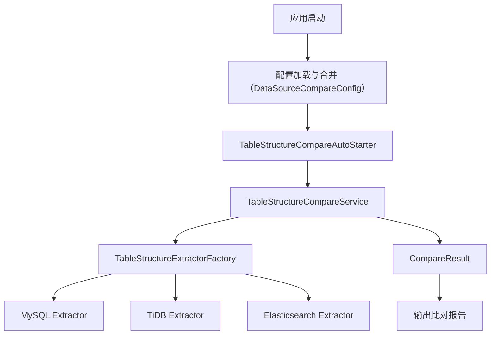

# HDS Schema Compare

异构数据源表结构比对工具，支持MySQL、TiDB、Elasticsearch和Java POJO之间的结构比对。

## 功能特性

- 支持MySQL、TiDB、Elasticsearch和Java POJO之间的表结构比对
- 支持表级属性比对（表注释、表属性等）
- 支持列级属性比对（列名、数据类型、是否可空、默认值、注释等）
- 支持索引结构比对（主键、唯一索引、普通索引等）
- 支持忽略特定字段或比对类型
- 支持POJO类与数据库表结构的比对，自动处理JsonProperty等注解
- 支持将比对结果输出为 Markdown 格式文件
- POJO 解析器 (`PojoTableStructureExtractor`) 引入缓存机制，提升重复解析相同 POJO 类时的性能
- 核心比对服务 (`TableStructureCompareServiceImpl`) 进行了结构优化，提高代码可读性和可维护性
- 支持从外部 classpath 下的 YAML 和 JSON 文件加载和合并 `compare-configs`，并与 Spring 环境配置按优先级合并

## 功能特点

- 支持多种数据源之间的表结构比对
- 支持表级属性比对
- 支持列结构比对
- 支持索引结构比对
- 支持自定义忽略字段和比对类型
- 支持批量表比对
- 支持详细的比对报告
- 支持ES与MySQL族数据库的特殊处理（如nullable、default值等）
- POJO 解析性能优化 (缓存机制)
- 灵活的配置加载机制 (Spring 环境, 外部 YAML/JSON 文件，带优先级合并)

## 架构图



## 配置说明

### 基本配置

```yaml
jtools:
  hdscompare:
    config:
      # 是否在应用启动时自动执行比对
      auto-compare-on-startup: true
      # 是否输出详细的比对信息到控制台
      verbose-output: true
      # (可选) 是否启用Markdown文件输出比对结果
      enable-markdown-output: false 
      # (可选) Markdown文件输出路径 (默认为 compare-results.md)
      markdown-output-file-path: "compare-results.md"
      # (可选) 是否从外部YAML文件加载额外的比对配置 (默认为 true)
      load-from-external-yaml: true
      # (可选) 外部YAML比对配置文件名 (classpath, 默认为 hdscompare-config.yml)
      external-yaml-config-file: "hdscompare-config.yml"
      # (可选) 是否从外部JSON文件加载额外的比对配置 (默认为 true)
      load-from-external-json: true
      # (可选) 外部JSON比对配置文件名 (classpath, 默认为 hdscompare-config.json)
      external-json-config-file: "hdscompare-config.json"
      
      # 比对配置列表 (此处的配置优先级最高)
      compare-configs:
        - name: "example-compare" # 会被 Spring 环境中的同名配置覆盖
          # 源数据源配置
          source-data-source:
            type: "mysql"  # 支持：mysql、tidb、elasticsearch、pojo
            data-source-name: "sourceDataSource"  # 当type为pojo时可不填
          # 目标数据源配置
          target-data-source:
            type: "elasticsearch"
            data-source-name: "targetDataSource"
          # 表比对配置列表
          table-configs:
            - source-table-name: "source_table"  # 当source-data-source.type为pojo时，填写Java类的全限定名
              target-table-name: "target_table"
              # 忽略的字段列表
              ignore-fields:
                - "field1"
                - "field2"
              # 忽略的比对类型
              ignore-types:
                - "COMMENT"
                - "DEFAULT"
```

### POJO比对配置示例

```yaml
jtools:
  hdscompare:
    config:
      compare-configs:
        - name: "pojo-to-mysql"
          source-data-source:
            type: "pojo"
            # data-source-name 可不填
          target-data-source:
            type: "mysql"
            data-source-name: "mysqlDataSource"
          table-configs:
            - source-table-name: "com.example.model.User"  # Java类的全限定名
              target-table-name: "user_table"
```

### 配置加载优先级与合并规则

`compare-configs` 的加载遵循以下优先级顺序，高优先级来源的配置项会覆盖低优先级来源中同名的配置项：

1.  **Spring 环境配置 (最高)**: 直接在 `application.yml` 或 `application.properties` 中 `jtools.hdscompare.config.compare-configs`下定义的配置项。
2.  **外部 YAML 文件**: 由 `external-yaml-config-file` 指定的位于 classpath 下的 YAML 文件 (默认为 `hdscompare-config.yml`)。仅当 `load-from-external-yaml` 为 `true` 时加载。
3.  **外部 JSON 文件 (最低)**: 由 `external-json-config-file` 指定的位于 classpath 下的 JSON 文件 (默认为 `hdscompare-config.json`)。仅当 `load-from-external-json` 为 `true` **且** 未从外部 YAML 文件成功加载任何配置时（即 YAML 文件不存在、内容为空、或 `load-from-external-yaml` 为 `false`），才会尝试加载此文件。

**合并行为**:
- 当从多个来源加载配置列表时，它们会合并成一个最终的列表。
- 如果不同来源中存在具有相同 `name` 属性的 `compare-config` 项，则来自较高优先级来源的配置将完全取代较低优先级来源的同名配置。
- 如果外部文件（YAML 或 JSON）中的 `compare-config` 项与 Spring 环境中已定义的项同名，则 Spring 环境中的版本将保留，外部文件的版本将被忽略 (通过 `putIfAbsent` 逻辑实现)。
- 外部 YAML/JSON 文件的根元素应该直接是一个 `CompareConfig` 对象的列表 (an array of compare config objects)。

## 类型映射说明

### POJO类型映射

POJO类型会自动映射到对应的数据库类型：

- 数值类型：
  - long/Long -> bigint
  - int/Integer -> int
  - short/Short -> smallint
  - byte/Byte -> tinyint
  - float/Float -> float
  - double/Double -> double
  - BigDecimal -> decimal

- 字符串类型：
  - String -> varchar
  - char/Character -> char

- 日期时间类型：
  - Date -> date
  - LocalDate -> date
  - LocalDateTime -> datetime
  - LocalTime -> time
  - Timestamp -> timestamp

- 布尔类型：
  - boolean/Boolean -> boolean

### MySQL到ES类型映射

- 数值类型：
  - bigint -> long
  - int -> integer
  - tinyint -> byte
  - smallint -> short
  - float -> float
  - double -> double
  - decimal -> scaled_float

- 字符串类型：
  - varchar -> keyword/text
  - char -> keyword
  - text -> text
  - longtext -> text
  - mediumtext -> text
  - tinytext -> text

- 日期时间类型：
  - datetime -> date
  - timestamp -> date
  - date -> date
  - time -> date

- 布尔类型：
  - boolean -> boolean
  - bool -> boolean

- 枚举类型：
  - enum -> keyword

## 使用说明

1. 添加依赖：

```xml
<dependency>
    <groupId>org.wesuper.jtools</groupId>
    <artifactId>hds-schema-compare</artifactId>
    <version>${latest.version}</version>
</dependency>
```

2. 配置数据源和比对规则

3. 注入服务并调用：

```java
@Autowired
private TableStructureCompareService compareService;

// 比对所有配置的表
List<CompareResult> results = compareService.compareAllConfiguredTables();

// 根据配置名称比对表
CompareResult result = compareService.compareTablesByName("example-compare");
```

## 注意事项

1. POJO比对时，会优先使用JsonProperty注解的值作为字段名
2. POJO比对时，会忽略Java中的nullable和default value等要求
3. 对于ES特有的字段（如number_of_replicas、number_of_shards等），在比对时会被忽略
4. 建议在比对ES时，忽略不影响数据检索和展示的属性（如creation_date、uuid等）

## 开发说明

### 项目结构

```
hds-schema-tools/
├── hds-schema-compare/                     # 核心比对模块
│   ├── src/
│   │   ├── main/
│   │   │   ├── java/
│   │   │   │   └── org/wesuper/jtools/hdscompare/
│   │   │   │       ├── config/             # 配置类。核心包括：
│   │   │   │       │   ├── DataSourceCompareConfig.java  # 定义所有比对相关的配置项，并处理外部配置文件加载与合并
│   │   │   │       │   └── SchemaCompareAutoConfiguration.java # Spring AutoConfiguration，用于自动配置核心服务和提取器Bean
│   │   │   │       ├── constants/          # 常量定义，如 DatabaseType.java
│   │   │   │       ├── extractor/          # 表结构提取器接口及实现。负责从不同数据源提取表结构信息。
│   │   │   │       │   ├── TableStructureExtractor.java      # 提取器接口
│   │   │   │       │   ├── MySqlTableStructureExtractor.java # MySQL提取器实现
│   │   │   │       │   ├── TidbTableStructureExtractor.java  # TiDB提取器实现
│   │   │   │       │   ├── ElasticsearchTableStructureExtractor.java # Elasticsearch提取器实现
│   │   │   │       │   ├── PojoTableStructureExtractor.java  # POJO提取器实现 (含缓存)
│   │   │   │       │   └── TableStructureExtractorFactory.java # 提取器工厂，根据类型获取对应提取器
│   │   │   │       ├── model/              # 数据模型。定义表、列、索引结构及比对结果等。
│   │   │   │       │   ├── TableStructure.java           # 表结构模型
│   │   │   │       │   ├── ColumnStructure.java          # 列结构模型
│   │   │   │       │   ├── IndexStructure.java           # 索引结构模型
│   │   │   │       │   └── CompareResult.java            # 比对结果模型
│   │   │   │       ├── service/            # 服务接口及实现。核心比对逻辑的实现。
│   │   │   │       │   ├── TableStructureCompareService.java      # 比对服务接口
│   │   │   │       │   └── TableStructureCompareServiceImpl.java  # 比对服务实现 (已重构)
│   │   │   │       └── starter/            # 启动器。应用启动时自动执行比对任务。
│   │   │   │           └── TableStructureCompareAutoStarter.java # 自动比对启动器 (支持控制台和Markdown报告)
│   │   │   └── resources/
│   │   │       └── META-INF/spring.factories # (如果SchemaCompareAutoConfiguration是自动配置模块)
│   │   └── test/                       # 测试代码
│   └── pom.xml                         # 项目依赖
└── hds-schema-compare-example/           # 使用示例模块 (展示如何配置和使用比对工具)
    ├── src/
    │   ├── main/
    │   │   ├── java/
    │   │   │   └── org/wesuper/jtools/hdscompare/example/
    │   │   │       ├── HdsSchemaCompareExampleApplication.java # Spring Boot 启动类
    │   │   │       ├── config/                                 # 示例数据源配置 (如JDBC, ES客户端)
    │   │   │       └── model/                                  # 示例POJO模型
    │   │   └── resources/
    │   │       ├── application.yml                         # 示例应用配置文件 (包含比对配置)
    │   │       ├── hdscompare-config-example.yml         # (可选) 外部YAML比对配置文件示例
    │   │       └── hdscompare-config-example.json        # (可选) 外部JSON比对配置文件示例
    └── pom.xml                                             # 示例模块的项目依赖
```

### 扩展支持

本工具设计时考虑了可扩展性，方便开发者添加对新数据源类型的支持或自定义比对逻辑。

1.  **添加新的数据源类型支持**
    *   **创建提取器实现**: 新建一个类实现 `org.wesuper.jtools.hdscompare.extractor.TableStructureExtractor` 接口。
    *   **实现 `extractTableStructure` 方法**: 
        *   此方法接收 `DataSourceCompareConfig.DataSourceConfig` (包含数据源类型、名称及自定义属性) 和 `tableName` (对于POJO则是类全名)作为输入。
        *   根据配置连接到数据源，查询或反射获取指定表/类的结构信息。
        *   将提取到的信息填充到 `TableStructure`、`ColumnStructure`、`IndexStructure` 等模型对象中。
        *   **关键：类型映射**：如果新增的数据源类型需要与其他已知类型（如 MySQL, Elasticsearch, POJO）进行比对，需在新的提取器中或相关模型（如 `ColumnStructure.addTypeMapping`）中定义其字段类型如何映射到这些目标数据库类型。可参考 `PojoTableStructureExtractor` 中 `JAVA_TO_MYSQL_TYPE_MAPPING` 和 `JAVA_TO_ES_TYPE_MAPPING` 的实现。
    *   **实现 `getSupportedType` 方法**: 返回该提取器支持的唯一数据源类型字符串。建议在 `org.wesuper.jtools.hdscompare.constants.DatabaseType` 中定义新的常量。
    *   **注册Bean**: 在 `org.wesuper.jtools.hdscompare.config.SchemaCompareAutoConfiguration` 中通过 `@Bean` 方法将新的提取器实例注册到 Spring 容器。`TableStructureExtractorFactory` 会自动发现并使用所有 `TableStructureExtractor` 类型的 Bean。

2.  **添加新的比对规则或属性**
    *   **模型层**: 若涉及新属性，首先在相关的模型类 (`TableStructure`, `ColumnStructure`, `IndexStructure`) 中添加这些属性及其 getter/setter。
    *   **提取层**: 确保对应的 `TableStructureExtractor` 实现能够提取这些新属性。
    *   **服务层 (`TableStructureCompareServiceImpl`)**: 修改 `compareTableProperties`, `compareColumns` (及其子方法如 `compareColumnDetails`, `compareStandardColumnProperties`), 或 `compareIndexes` (及其子方法 `compareIndexDetails`) 来包含新属性的比对逻辑。
        *   当属性不匹配时，创建相应的 `TableDifference`, `ColumnDifference`, 或 `IndexDifference` 对象，并设置准确的 `DifferenceType` 和 `DifferenceLevel`。
        *   若新属性对整体匹配度计算有影响，可能需调整 `calculateMatchPercentage` 方法中的权重。

3.  **添加新的忽略类型 (`ignoreTypes`)**
    *   在 `TableStructureCompareServiceImpl` 的相应比对逻辑前，通过 `isIgnoredType(config, "YOUR_NEW_IGNORE_TYPE")` 进行检查。
    *   在 README 的"配置说明" -> "忽略类型说明"部分添加对新 `ignoreTypes` 值的解释。

4.  **自定义POJO字段名/注释提取**
    *   `PojoTableStructureExtractor` 中的 `getFieldName` 方法目前通过 `@JsonProperty` 注解获取字段名。
    *   `getFieldComment` (当前为空) 和 `getClassComment` (当前为空) 方法可以被扩展以支持从自定义注解或 Javadoc 中提取注释 (注意：Javadoc 解析可能需要额外库和更复杂的实现)。

### 其他开发细节

*   **类型映射维护**:
    *   `PojoTableStructureExtractor` 内部维护了Java类型到MySQL和Elasticsearch类型的静态映射表。若目标数据库类型增加或类型系统变更，这些映射表需同步更新。
    *   对于数据库间的直接比对，类型兼容性通常由数据库本身保证或在服务层通过名称相似性判断。对于复杂的异构场景，`ColumnStructure.TypeMapping` 机制允许一个源列类型声明其可兼容的多种目标列类型，增强了灵活性。

*   **POJO解析特性**:
    *   **嵌套/集合类型**: 当前 `PojoTableStructureExtractor` 会将POJO中的嵌套对象或集合类型字段视为一个单独的"列"，其数据类型是该嵌套对象或集合元素的简单类名，不会递归展开嵌套结构。如需展平，需扩展提取器。
    *   **字段过滤**: `PojoTableStructureExtractor` 通过 `field.isSynthetic()` 过滤合成字段，但未显式处理 `static` 或 `transient` 字段。如有需求，可在 `extractColumns` 方法中添加相应过滤逻辑。

*   **Elasticsearch客户端配置**:
    *   `ElasticsearchTableStructureExtractor` 依赖一个 `Map<String, RestHighLevelClient>` Bean。使用者需在Spring配置中正确构建并注入此Map，其中key为配置文件中的 `dataSourceName`。具体配置方式可参考 `hds-schema-compare-example` 模块中的示例。

*   **日志利用**:
    *   项目广泛使用SLF4J进行日志记录。开发者可通过调整 `application.yml` 或日志配置文件中 `org.wesuper.jtools.hdscompare` 包的日志级别 (推荐 `DEBUG` 级别进行问题诊断) 来获取详细的执行信息，便于理解内部流程和调试。

## 注意事项

1. POJO比对时，会优先使用JsonProperty注解的值作为字段名
2. POJO比对时，会忽略Java中的nullable和default value等要求
3. 对于ES特有的字段（如number_of_replicas、number_of_shards等），在比对时会被忽略
4. 建议在比对ES时，忽略不影响数据检索和展示的属性（如creation_date、uuid等）
